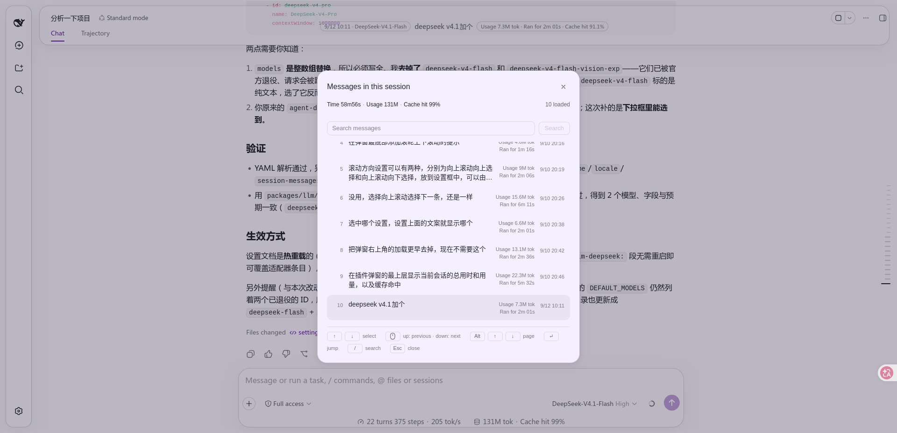
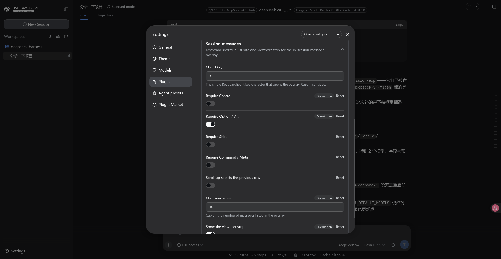
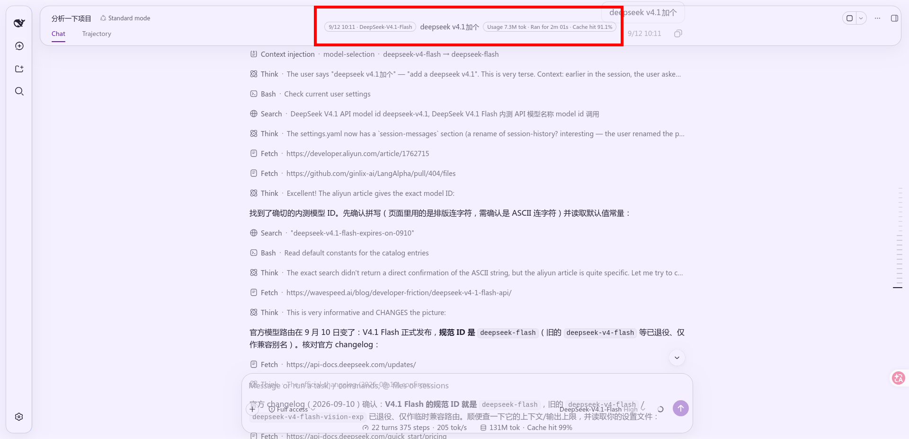

# dsh-session-messages

English | [中文](README.zh.md)

An in-session message viewer with two surfaces:

1. **Message list** (`Ctrl+S` by default): opens a list of the **messages loaded in the current
   session**; pick with the arrow keys and `Enter` (or a click) jumps the transcript to that
   message. The list can be searched — see [Search](#search).
2. **Viewport strip** (optional, off by default): a block centred on the session header showing
   **the message you are currently reading**, with its clock, usage and duration. See
   [Viewport strip](#viewport-strip).

This is a **standalone plugin installed into a profile**. It does not modify any source of
`deepseek-harness` (`packages/` is untouched).



## Languages

The plugin's own copy ships in seven languages, all in `src/client/locales.ts`:

| Locale | Registered as | Notes |
|---|---|---|
| `en` | built-in, together with `zh` | The source of truth; every other dictionary mirrors it key for key |
| `zh` | built-in, together with `en` | |
| `ja`, `ko`, `es`, `fr`, `de` | language-pack locales | Only the **dictionary** is this plugin's; the **definition** that makes them selectable belongs to a language pack (`dsh-catppuccin` in this profile) |

Two things about that split are deliberate:

- **This plugin never calls `addLanguage`.** The language pack owns the definition, and calling it
  here would throw against the pack's existing one. Declaring a language on the strength of a
  single namespace would also put a mostly-English entry in the picker.
- **Every dictionary is typed `Record<MessagesKey, string>`.** Adding a key to `MessagesKey` fails
  to compile until all seven translations exist, so no locale can silently fall back to English for
  a key that was merely forgotten. That guarantee matters more than the `en` fallback chain does.

Every user-facing string is read through the locale seat, including the entry's name in the slot
ledger — a thunk, so it follows a locale switch without re-registering. The clock stays the host's: it
is a bare instant with no label.

If the profile carries no language pack, the five pack locales are simply not selectable and their
dictionaries sit unused. Nothing else changes.

**A host pill's label cannot be trusted.** The host's own pills ship in `zh` and `en` alone, so under
any pack locale they fall back to English and `Usage 1.06k tok` lands in a Japanese UI. The two numbers
on each row are therefore read in halves: the value still comes from the host's pill (per-turn tokens
and wall time are not derivable from where this plugin sits), while the label is this plugin's own
`turnUsage` / `turnDuration`.

### Keeping one layout across languages

A longer label must not rearrange a surface. Three mechanisms, one per way it could:

- **The dialog's rows are language-proof by construction.** The preview is `flex: 1` with
  `min-width: 0`, so it absorbs every width difference, while the stats column and the clock are
  `flex: none` and stay pinned to the right edge — the clock on the preview's first line, in every
  language. The dialog title and the header's session totals ellipsize instead of pushing the close
  button and the loaded count out of the row.
- **The strip's two capsules cannot reflow** — they are `Tag`s, which are `nowrap`, so their length
  directly decides how much room the message gets. The seven languages therefore give the preview
  different widths, and that is accepted: shrinking a label costs accuracy. An earlier version cut the
  cache-hit label down to a bare `Caché` / `Cache` — the object with no metric — and each language now
  uses its own standard short term instead (`Cache hit` / `缓存命中` / `キャッシュ率` / `캐시 적중률` /
  `Aciertos de caché` / `Taux de cache` / `Cache-Treffer`): **terminology outranks a few pixels.**
- **The strip's session fields are read reactively**, through the seat's standard `useProjection`
  rather than through an injected face. A polled read could come back empty before the session
  binding existed, which dropped the model and the cache share for a tick — one language looking
  different from another for a reason that had nothing to do with language.

## Layout

```text
session-messages-plugin/
  package.json        dsh.bundle + dsh.client declarations, exports map
  cordis.patch.yml    the layer patch (registers itself as a Loader entry, and its config)
  build.mjs           build script (tsdown's programmatic API)
  tsconfig.json       IDE type resolution only; points at checkout sources (read-only)
  src/
    index.ts                  Node half: Config Schema + publishes config into the page
    shared.ts                 the config shape and resolution, shared by both halves
    client/
      index.ts                Browser half: registers the two slots and the configuration form
      transcript.ts           the transcript DOM contract (collectors both consumers share)
      search.ts               search: folded matching, hit ranges, excerpting (pure)
      model-names.ts          model display names: host catalog → id lookup (external store)
      turn-facts.ts           per-turn facts: folds the event window to turn → model + cache share (usage via the host's deriveTurnTokenUsage)
      overlay.tsx             the list overlay: collection and jumping
      hud.tsx                 the viewport strip (header action seat)
      use-messages-config.ts  resolve the live config (config form → page global)
      session-totals.ts       session-wide facts: projection reads + compact formatting
      settings-card.tsx       the bundle's configuration form on the Plugins page
      settings-form-holder.ts   the card's bound config form → overlay, one-way bridge
      locales.ts              the seven dictionaries (en, zh + five pack locales)
  lib/                build output (index.js / client.js)
  docs/               the screenshots the two READMEs embed (en / zh pairs)
```

## Install

**From npm** (after a publish — installs the prebuilt artifact, no build authorization needed):

```sh
dsh plugin --profile web add dsh-session-messages
```

**From a tarball** (also needs no authorization, and is the way to exercise the real artifact
before publishing):

```sh
npm pack                                   # writes dsh-session-messages-0.1.0.tgz
dsh plugin --profile web add ./dsh-session-messages-0.1.0.tgz
```

**While working on the sources** (this repository is the plugin's own, so it can be linked):

```sh
npm run build                              # re-run after any src change
dsh plugin --profile web add .
```

⚠️ **Remove before switching install modes**: an existing install — a link especially — shadows
the new package.

```sh
dsh plugin --profile web remove dsh-session-messages
```

Then **restart** `dsh web`: a new bundle layer, and any change to an existing one, both need a
restart.

### Development

```sh
npm ci                                     # install dependencies
npm run build                              # writes lib/index.js + lib/client.js
npm run typecheck                          # tsc --noEmit
```

**Versions are pinned rather than left to `latest`**: the `@deepseek-ai/*` family publishes a
stale `latest` tag (`0.0.1-rc.1`) while the line this plugin matches is `0.1.7-rc.1` under `next` —
a bare install resolves to the wrong one. Bump these pins when the host moves.

`overrides` pins one more version for the same reason, one level down: `tsdown` asks for
`rolldown ~1.2.0`, but `rolldown@1.2.10` never published its
`@rolldown/binding-linux-arm64-musl` binary, so a fresh resolve produces a lock file `npm ci`
refuses as out of sync. `rolldown` is therefore held at `1.2.9`, the last complete release. The
entry can go once upstream publishes a full platform set again.

## Usage

| Input | Effect |
| --- | --- |
| `Ctrl+S` | Open / close the message list |
| `↑` `↓` | Move the highlight |
| `Alt`+`↑` `↓`, `PageUp` `PageDown` | Page: the list scrolls one screenful while the highlight **holds its place** (it meets the edge at either end); with a `maxRows` small enough to fit one screen, pages switch whole |
| `Enter` | Jump to the highlighted message |
| Mouse move / click | Move the highlight / jump |
| Wheel | Move the highlight, one row per notch; a trackpad accumulates its much smaller travel into whole rows. Direction follows `wheelInverted` |
| `Esc` | Close |

The paging `Alt` is `⌥ Option` on macOS — the same physical key — and the hint bar prints
whichever name the platform uses. On a MacBook with no dedicated paging keys, `Fn`+`↑` `↓` works:
macOS translates it to `PageUp` / `PageDown`.

## Configuration

Edit the `config:` block of `cordis.patch.yml`, or override it by id `session-messages` in the
profile's own `cordis.patch.yml`. The shortcut is **not** hardcoded in the source:

| Field | Default | Meaning |
| --- | --- | --- |
| `key` | `s` | The lowercase form of `KeyboardEvent.key` |
| `ctrl` | `true` | Whether Ctrl is required |
| `alt` | `false` | Whether Alt is required |
| `shift` | `false` | Whether Shift is required |
| `meta` | `false` | Whether Meta is required (Cmd on macOS, Win) |
| `wheelInverted` | `false` | Wheel direction. Off: scrolling up selects the previous row; on: scrolling up selects the next |
| `maxRows` | `50` | Most rows the list renders at once; the window follows the highlight a page at a time, so this doubles as "rows per page" |
| `showHud` | `false` | Whether the viewport strip is shown in the session header (see below). Off by default |

For `Cmd+S` on macOS: `ctrl: false`, `meta: true`.

## Editing it on its Plugins page



The same fields can be edited in the UI, without touching `cordis.patch.yml`:

**Plugins** (the sidebar entry) → `dsh-session-messages` → the form above that bundle's row list.
It is open by default.

The form lists the chord key, the four modifiers, the wheel direction, the row cap and the strip
switch. Every field carries its own Reset, a field the user layer has overridden is marked, and the
header collapses the form and shows an unsaved badge. Save applies the draft; discard drops it.
No restart is needed.

The values live in the settings namespace `session-messages` — the profile entry id in
`cordis.patch.yml` — which the Node half owns by marking every `Config` field `.volatile()`; that is
what makes them live-editable, and the browser half reads the same document through
`ctx.configForms`. The form itself is contributed through the Plugins page's `plugins.bundle.config`
seat, keyed by the **package name**: that key is what pairs the form with this bundle's page, so the
two have to be renamed together.

## Viewport strip



The switch is `showHud` (the "Show the viewport strip" toggle in the configuration form, or
`cordis.patch.yml`). With it on, a block appears **centred on the session header** and updates as
you scroll:

```text
21:36 · deepseek-chat  Data source: read the projection, not the DOM — the point is
                       reading projections.faceOf, which the client exposes, rather
                       than scraping the rendered DOM.
                                        Usage 1.2k · Ran for 12.3s · Cache hit 99%
```

(The two ends are really two **outlined capsules**: "when, and with what" on the left, "what it
cost" on the right. The preview occupies up to three lines beside them — plain text cannot do
that, see [Why the ends are `Tag`](#why-the-ends-are-tag).)

It is centred on the **header**, not on the viewport: it registers into
`conversation.session.header.actions` (the seat the host declares for title-adjacent session
actions — the same one `ui-agent-preset`'s preset label and `ui-jobs`' job list use), but it does
**not queue up as one more item** there. It takes itself out of flow and centres on the header
box.

### How the centring works

Both axes aim at the **header box itself**: horizontally at its centre line, and vertically at
its centre line too.

**Horizontal** — pure CSS. The containing block of `position: absolute` is ui-conversation's
`.root`, which declares `position: relative` for exactly this purpose (`positioning context for
slot-owned absolute chrome`). The header spans that whole column, so 50% of `.root` is the
header's own centre line; it stays put when the sidebar collapses or expands, where 50% of the
viewport would not.

**Vertical** — measured, by reading `<header>`'s own box and taking its centre. The strip is out
of flow, so nothing in CSS knows where that box is; measuring is the only way.

The anchor is the **header** rather than the title row, because "centred on the overlay" means
exactly this header box: besides the title row it also carries the view tabs, so it is much taller
than its first line. Anchoring on the row left the strip visibly high — that was the second
version.

Two attempts worth not repeating:

| Tried | Result |
|---|---|
| The **static position** of an absolutely-positioned flex child (`top: auto`) | The spec says such a child is laid out as if it were the sole flex item, so it should honour the parent's `align-items: center`. **In practice it landed at the containing block's top edge** and the strip was clipped by the window. |
| Anchoring on the seat's own boxes | Which of them collapses depends on the composition — `headerActions` is zero-height when the strip is its only child, the corner is `display: none` when empty — so it needed a chain of fallbacks. The header is one element that is always there; the chain was wasted effort. |

Taking it out of flow is also the precondition for centring at all: the seat's `headerActions` is
`flex: none`, and the row's free space belongs to `titleCluster` (`flex: 1`), so **an ordinary
in-flow item in that seat can never reach the middle**.

`top` is written for the element's **top edge** and the transform is horizontal-only, so if the
measurement never runs the strip falls back to its static position and stays visible instead of
being pulled off-screen — the first version used `translate(-50%, -50%)` and disappeared entirely
under the same conditions.

`top` is written straight onto the node rather than through React state: it is a function of
layout, and routing it through state would put a state update inside the very frame loop that
measures it.

### The look is copied, not designed

It is copied from the preset label in the same seat (`AgentPresetLabel.module.css`):

| Property | Value | Relation to the preset label |
|---|---|---|
| `border-radius` | `6px` | The same rounded rectangle, **not a pill** |
| `background` | `var(--dsw-alias-fill-tsp-secondary)` | The same translucent fill, not `bg-layer-*` |
| `color` | `var(--dsw-alias-label-secondary)` | The same label tier |
| `min-height` | `22px` | The same floor; **no longer a fixed height**, see below |

The first version used "999 radius + a hard border + `bg-layer-3` + `label-primary`" — none of the
header's own chrome is built that way, so it read as a card stuck on top. **To blend into a piece
of UI, copy the recipe it already uses; do not invent one.**

### The preview is set to be read, not to be scanned

One **deliberate departure** from the preset label: the message body uses 14px / 20px (body size,
matching the transcript) and is allowed to wrap, up to three lines, instead of the chip's 12px
single line. This is something to **read**, not a label to scan.

- The container is therefore `min-height` rather than a fixed `height`, and grows with the line
  count.
- The preview's character cap is `MAX_HUD_CHARS = 500`, with the visual cap enforced by a
  three-line `-webkit-line-clamp`. The character cap is generous because narrow scripts (Latin)
  fit more into the same three lines; slicing earlier would show **less**.
  `overlay.tsx`'s row previews use the same `-webkit-box` triple.

### Why the ends are `Tag`

The clock and the usage / duration pair are the host's **`Tag` primitive** (`tone="outline"`), not
spans styled to look like one. `Tag` brings its own geometry (999 radius, `1px 8px`, 11px/17px,
`nowrap`) and palette (`0.5px solid var(--dsw-alias-border-l4)` + `label-tertiary`), so nothing
here restates any of it.

Why it had to change: all three parts used to be plain text on one shared background, and **a
reader had no way to see at a glance where the message started**. An outlined capsule is the
visual language of meta information; body copy is not. One level of contrast separates them.

Three things that then need no attention:

- `Tag`'s box, including its hairline, is exactly 20px — the same height as the preview's 14px/20px
  first-line box. For a **single-line message** the two capsules sit level with the text with no
  adjustment at all.
- When the message wraps, the container's `alignItems: center` keeps them centred: both capsules
  centre on the **whole message block**, not on its first line (which, beside a two-line preview,
  made them look like they had drifted upwards).
- Using the `Tag` component rather than copying its CSS: it is required from the module table
  (external), so what arrives is the host's **already-loaded** instance — consistent by
  construction, and immune to the host changing its styles.

**All three parts are centred**, which takes two things at once:

- The preview is `flex: 0 1 auto` — **it may shrink, but it must not grow**. Letting it grow
  (`1 1 auto`) made the strip always as wide as `maxWidth`, pushing the clock to the left edge and
  the numbers to the right edge: three parts pinned to the ends of a wide box read as anything but
  centred. Without the growth the strip hugs its content and the three sit together as one group.
- The container sets `textAlign: center`, so wrapped preview lines centre instead of aligning left.

### What it shows: five fields, two granularities

The capsules split by axis: "when, and with what" on the left, "what it cost" on the right.

| Field | Granularity | Source |
|---|---|---|
| Clock | that message | the row's `IconActions` label |
| Message text | that message | the row's text (trailing timestamp leaf stripped) |
| Usage / duration | **that turn** | the two capsules in that turn's tail |
| Model | **that turn** | that turn's `assistant/message` event, its `message.source`, folded out of the binding's event window (`turn-models.ts`). The **display name** is then resolved through `remote.session.modelCatalog()`, so it reads exactly like the composer's picker; a turn with no readable model says **Unknown model** |
| Cache hit | **that turn** | that turn's usage, folded by the host's `deriveTurnTokenUsage`, as `cacheRead / billed input` at the host's turn-dialog precision (one decimal) |

The per-turn model comes from the session's own **event window** (`binding.eventSource`): each turn's
`assistant/message` event carries `message.source.{provider,model}` — the very thing the host folds
per-turn routes from — so the strip names the model of whichever turn it lands on, and scrolling back
to a message sent before a switch no longer shows the model selected now. A turn outside the loaded
window says **Unknown model** instead — deliberately **not** the session-wide `modelSelection`, which
is a fact about a different moment and would be stated with the same confidence as the truth.

**The cache share is per-turn too.** The usage is folded by the host's own `deriveTurnTokenUsage`
(`@deepseek-ai/dsh-token-meter/client` — the function ui-chat builds a turn's tail with) and printed
through the host's formatter at the host's turn-dialog precision (one decimal, extra decimals near a
full hit). Its rules are deliberately **not** re-derived here: which events count, when a final message
supersedes a streaming sample, and that an incomplete turn yields nothing are subtle enough that a
second implementation would diverge invisibly until someone compared two surfaces. A turn that is
still running has no figure yet — the host fails closed on it — so the clause is simply absent.

There is a second route to per-turn data — the `conversation.chat.node` seat injects a `useTurnData`
hook, and its occupant can derive a turn's wall time from `node.location.turn.start/end` — but it
answers for the ONE turn its node renders, while the strip needs whichever turn sits under the fold and
the list needs every turn. Nor can that seat simply be taken: its keys are ui-chat's own
`ChatNodeKind`s, and occupying one would REPLACE ui-chat's renderer. The event window is how this
plugin gets there instead.

The figures match the host's own: the denominator is the **sum of the three billed input buckets**
(verbatim the host's `billedInputTokens` in `StatsPills`), and the percentage is a **port of the
host's `formatCacheHitPercent`** (`token-format.ts`) — one projection, one algorithm, so the strip,
the dialog header and the composer's pills print the same characters. That rule is worth stating: a
near-full hit is **not clamped to 99.9**, it earns extra decimals (`99.6` / `99.95`), which is both
true and visibly short of a full hit.

The model reads as the **display name the composer's picker shows** (for example
`DeepSeek-V4.1-Flash`), resolved through `remote.session.modelCatalog()`; a model absent from that
catalog (a retired one) falls back to its raw id, and an unreadable turn says "Unknown model". It is
deliberately **not** read from `ctx.modelDirectories` — a **selection surface** that lazily creates
per-session state and throws for a session outside the active list, which a read-only label should
not pull in.

The width cap is therefore `min(760px, 58vw)` rather than something narrower — **the capsules
cannot compress**, and a narrower cap would squeeze out the preview first, which is the very thing
the strip exists to show.

`pointer-events: none` because it can overlap a long title's tail and must not swallow clicks.

One thing that comes for free: the header hides itself with `display: none` for a blank session, and
the strip disappears with it as a descendant — the plugin never has to inspect session state.

### Which message counts as "the one you are reading"

It is **the last row that has reached the viewport's top band**, not "the first row still on
screen".

The reason is empirical: a user message is one line tall while its answer can be screens. Judged by
"still on screen", the user message would have scrolled away long before the answer ended and the
strip would go **blank for most of it** — which reads as broken rather than as empty. Judged by
"has reached the band", it behaves like a sticky section header: it keeps naming the message you
are reading until the next one reaches the band. While every row is still below the band (the
reader is above the first message), it falls back to that first message.

**The band (`FOLD_BAND_PX`) is not zero, and that matters.** It is `viewport top + LAND_OFFSET_PX +
2px`:

- `landOnRow` places a jump's target **`LAND_OFFSET_PX` (24px) below the viewport top** — that
  breathing room is what the offset is for. Written as a strict "has crossed the top"
  (`top < viewTop`), the target row **has not crossed yet**, so the strip named the row **above** it:
  every jump lagged a message behind.
- The `+2px` is sub-pixel slack: the landed position measures 24.0000…, and a bare `<` would drop it.
- A wider band also makes the strip flip to the next message **slightly earlier** while scrolling,
  which is the direction it wants to err in anyway.

`LAND_OFFSET_PX` therefore moved from `overlay.tsx` into `transcript.ts`, the contract layer both
consume: the jump's landing arithmetic and the strip's detection band were always the same fact, and
two copies of it were bound to diverge.

**Both surfaces that name a message share this rule.** They each used to answer "which message is
the reader on" for themselves — this sticky band in the strip, an "at least 30px visible" test in the
dialog — and the two disagreed on exactly the common case: **a long message scrolled down to its last
few pixels**. The strip kept naming it (the reader really is still inside it) while the dialog
disqualified it and jumped to the next message, so one scroll position produced two different answers.

There is now one entry point, `readingRow(scroller)` in `transcript.ts` (over the pure
`pickRowUnderFold`), and the strip's `hitOfViewport` and the dialog's `collectMessages` both read it:
**one scroll position, one message**. The dialog keeps one exception — pinned to the floor it takes the
newest row, which may not have reached the band yet in a freshly opened session.

To change the rule, edit `pickRowUnderFold` in `transcript.ts` — one place, pinned by the
`fold-rule-check` cases.

### Why it is cheaper than the list

The strip runs on scroll frames, so it takes a different collection path (`transcript.ts` is the
contract layer both share):

- **No whole-screen clone.** The list `cloneNode`s every row per collection pass; the strip parses
  only the **one** row in the viewport and caches the result by row id — scrolling inside one turn
  clones nothing.
- **No full stats map.** The list scans every turn tail to build a `Map`; the strip locates that one
  tail directly by `data-chat-turn`.
- **Early exit**: rows are in document order, so the scan stops at the first row still below the band.
- When none of the four fields changed it hands back the same object, letting React skip the render.

### When it re-reads

| Trigger | Why |
|---|---|
| `scroll` (document, **capture** phase) | Scroll events do not bubble, but a capture-phase listener still sees every descendant's. That avoids having to locate the scrollport up front, and incidentally solves "it may not exist yet" |
| `resize` | Rewrapping changes which row is in the viewport |
| Every second | A turn's final pill values are a **DOM mutation, not a scroll**; a scroll listener alone would leave the strip showing the live numbers forever |

The strip is `aria-hidden`: it repeats content that is already on screen, and announcing it again
would only make a screen reader say everything twice. It needs no stacking handling either — as a
descendant of the header it is already above the transcript and below the dialog.

## Where the message list comes from

The list is collected from the **rendered DOM** rather than from an API: the one seat that hands out
turn data, `conversation.chat.node`, covers only the single turn its own node renders, while the list
needs every turn — see the scope constraint above. This is not a hack — these attributes are contracts
`ChatView` itself resolves its own scroll anchors through, so breaking one would break the host first:

- `[data-conversation-scroll]` — the scrollport (`ChatView`'s own `scrollerOf` looks for it)
- `[data-chat-flow-kind="user" | "steering"]` — one human message row
- `[data-chat-anchor-key]` — the row's identity (`ChatView` restores scroll position by it)
- `[data-chat-turn]` — the turn the row belongs to
- `[data-turn-tail]` — that turn's tail, which seats the usage / duration capsules

The clock leaf is found by **content**, not by a selector (the host's class names are hashed), and
the pattern mirrors the host's own `clock.md` / `clock.ymd` templates rather than guessing how a
language writes a date:

| Locale | `clock.md` | `clock.ymd` |
|---|---|---|
| `zh` | `{m}月{d}日` | `{y}年{m}月{d}日` |
| `en` | `{m}/{d}` | `{y}-{m}-{d}` |

Every other locale falls back to `en`, so those five shapes are all the host can print. That table is
why the pattern is five explicit shapes rather than "a Chinese form plus an English form": an earlier
version assumed `Mon D`, never matched the host's real `9/10 20:16`, and so left the timestamp glued
to the end of the message text — in every language that was not Chinese, and in both surfaces at
once, since both read through the same split.

Both surfaces share it, along with the other transcript primitives, in `transcript.ts`.

Each row's **usage** and **duration** are not computed here either: they are the **values** read from
the two capsules in that row's turn tail (`TurnUsagePanel` / `TurnTimePanel`), which the host has
already computed and formatted. **Their label is not the host's**, though — the text is cut at its
first digit and prefixed with this plugin's `turnUsage` / `turnDuration`, because the host's own
labels ship in `zh` and `en` only and fall back to English under any pack locale.
The capsule class names are hashed, so they are located by **contract position**: the tail's last
two `aria-haspopup="dialog"` buttons are the usage panel and the time panel, in that order, told
apart by icon geometry (usage draws a database icon containing `<ellipse>`; time a clock containing
`<circle>`).

Jumping uses `ChatView`'s own arithmetic too:
`scrollTop += row.top - scrollport.top - 24`.

The cost: **only the loaded window can be listed**. Older messages are paged in by the plugin
itself, with no manual control: opening fills the list to `maxRows`, and the prefetch pulls the next
page as the highlight comes within the oldest 8 rows (through `ISession.loadOlder()`). The prefetch
does not fire repeatedly for the same page — the highlight is held by id, so after N rows are paged
in its index grows by N and it leaves the trigger zone.

## Search

Press `/` inside the dialog to focus the box (or click it), type, then submit with `Enter` or the
**Search** button.

**Filtering as you type is deliberately not done.** The corpus is collected DOM and every collection
pass clones rows; putting that on each keystroke costs real work and yields a list that moves under
the reader's hands.

### Matching

```text
NFC → lowercase → substring
```

- **NFC is not optional.** A Japanese `が` typed on an IME may arrive as one code point or as `か`
  plus a combining mark; without folding, a reader can see a match and fail to find it. Folding is
  also what keeps hit offsets on the characters actually displayed (it happens at collection time,
  see `transcript.ts`).
- **Plain substring, never a pattern.** A reader typing `(` or `[` is typing characters from a
  message, not a regular expression, and an unparseable query is a failure they cannot fix by typing
  more.
- **Case folding is locale-independent** (`toLowerCase`, not `toLocaleLowerCase`): whether `I`
  matches `i` must not depend on the language the UI happens to be showing.
- **The clock is searched too**: `9/10` is a natural way to ask, and the label is already on the row.

### A hit has to be visible

Row previews are clamped to two lines, so a hit deep inside a message would produce a row **marked as
a hit with no visible reason**. While a search is running the preview therefore shows the region
around the hit, with an ellipsis at each cut end; clearing the query restores "head of message, then
truncated". The ranges come from `search.ts` as pure functions, already rebased onto the string that
gets rendered.

### `Enter` carries three meanings

Decided by state, never by a mode:

| State | `Enter` |
|---|---|
| The box holds something unsubmitted | **submit the search** |
| Filtering, and the box is submitted | **jump to the highlighted row** |
| Nothing matched | **widen the corpus by one page, then filter again** |

The third row is the whole of "keep looking further back" — no button, no new key. Each press buys
exactly one page and stops when `hasMore()` does, so a query matching nothing cannot drag the entire
history in.

`Esc` unwinds one step at a time: first the search, then the dialog. A submitted query counts as much
as a typed one, so a filter can never stay in force behind an emptied box.

### Coverage

**It searches the loaded window, not the session.** That is a boundary rather than a shortcut: the
host exposes no in-session search to a client plugin — `ctx.sessions.search` is cross-session and
answers with one best snippet per session and no message anchor, and the granularity that would fit
(`sessionQuery.searchEvents`, whose hits carry `seq`) exists only on the host side, with no remote
endpoint.

The header therefore reports two numbers: `Matched 3 of 50`. The numerator is the hits, the
denominator is **what was searched** — a bare numerator would read as an answer about the whole
session.

## The dialog's session totals

The top of the dialog carries three numbers for the whole session (not the loaded window):

```text
Time 2m42s · Usage 5.5K · Cache hit 60%          30 loaded
```

They are **not** scraped from the DOM: they read `ISession.projections`, the client's public
projection read face (`faceOf(key).getSnapshot()`), and both keys are computed by the Host over the
**entire log**:

| Key | Fields read | Header's definition |
| --- | --- | --- |
| `sessionStats` | `llmMs`, `toolMs` | `Ran for` = model requests + tool execution, total wall time |
| `tokenUsage` | `uncachedInputTokens`, `cacheReadTokens`, `cacheWriteTokens`, `outputTokens` | `Usage` = billed input + output; `Cache hit` = cache reads / billed input |

Why not scrape: neither value exists in any visible text (the session time lives only inside the
stats dialog, which is closed by default), and reading numbers also skips "parse `1.2K` back into
the number it was printed from". Formatting follows the host's conventions: compact tokens
(`12.2K` / `1.2M`), compact durations (`45.2s` / `2m42s`), and the host's own cache-hit format (the
port described above), where **a partial hit never rounds up to 100%** — a near-full hit gains
decimals instead of being clamped.

## How the config reaches the browser

The boot graph carries no config, so the Node half listens for `webserver/index-inject` and pushes
a row of `{ kind: 'global', name: '__DSH_SESSION_MESSAGES_CONFIG__', value: config }`. The browser
half reads that global and falls back to the same defaults when it is absent.

## Implementation notes

- **Overlay seat**: the `shell.overlay` slot (declared by ui-layout; frame level, click-through).
  The component stays mounted and returns `null` while closed, so the shortcut listener is always
  armed.
- **The keyboard uses the capture phase**: the composer is a Lexical editor that registers its own
  key commands at `COMMAND_PRIORITY_CRITICAL`; a bubble-phase listener would be swallowed first.
- **`Ctrl+S` must `preventDefault()`**: the browser's default is "save page".
- **The wheel listener must be native and non-passive**: React registers `onWheel` passively at the
  root, so `preventDefault()` inside a synthetic event cannot stop the list's own scroll and the
  highlight movement and that scroll would stack. The plugin therefore calls
  `addEventListener('wheel', …, { passive: false })` on the list element directly.
- **The client bundle must be CJS**: the artifact is wrapped in
  `window.__ModuleLoader__.load({ factory: (require) => {...} })`, whose body cannot contain an ESM
  `import`. tsdown's CLI cannot start here (its config loader wants `unrun`), so the build uses the
  programmatic `build()` API with `config: false`.
- **Only specifiers the module table knows stay external; everything else is bundled.** The table
  answers exactly three things: platform seeds (`react` / `react-dom`), already-materialized modules,
  and registered package factories (the composition's own client bundles). A package outside that set
  is unreachable at runtime **however it is declared** — `require` throws "missed the module table",
  which the loader itself calls a build-time externals drift. Hence a **whitelist**: `react` /
  `react-dom` / `@deepseek-ai/dsh-client-ui-primitives` stay external (instance identity has to match
  the shell's), and everything else — `@deepseek-ai/dsh-token-meter/client` included — is bundled,
  because bundling always works while externalizing wrongly fails at boot. The host's own ui-chat can
  import that fold because it is **bundled into the same bundle**, not because the table serves it.
  The whitelist matches by PACKAGE, not by exact specifier: the JSX transform imports
  `react/jsx-runtime`, and bundling that drags React's **development branch** (which reads
  `process.env.NODE_ENV`) into the browser.
- **The build asserts browser purity** (`assertBrowserPurity`): the artifact must not mention
  `process.` / `Buffer` / `__dirname`, and every `require(...)` in it must be one of the whitelisted
  specifiers. Both are failures that already happened here — "missed the module table" and "process is
  not defined" — and both are plainly visible in the finished artifact, so the build fails instead of
  the page.
- **The Node half is the opposite: bare imports all stay external** and Node resolves them —
  bundling `schemastery` would give the host's Schema a second copy, and schema identity is compared
  by reference.

## Known limitations

- Only the loaded window can be listed; older messages are paged in automatically by the fill on
  open and the prefetch near the oldest row. There is no manual button.
  **Search covers that same window**: with no hit on screen, `Enter` is the only way further back,
  one page at a time. The strip's **per-turn model** is bounded by it too: a turn outside the window
  reads "Unknown model".
- Search does not survive an open: the query is cleared and the full list restored each time (the
  dialog's first job is position, not filtering).
- The model **display name** comes from the host catalog (`remote.session.modelCatalog()`); in a
  composition without the remote layer the strip falls back to the model id (`deepseek-flash`).
  Nothing else changes.
- The viewport strip only tracks **human messages** (`user` / `steering` rows) — that is the
  plugin's whole data model, and an assistant answer is not its subject. While reading a long answer
  it names the question that answer belongs to.
- Row previews are taken from the row's text (trailing timestamp leaf stripped) and truncated to 240
  characters before CSS ellipsis takes over.
- Usage / duration come from that turn's tail capsules: while a turn is still running, or when it
  carries no timing or usage, the corresponding slot stays empty.
- The dialog's session totals are re-read on open and on each page filled in (snapshot semantics,
  like the list), not subscribed: they do not tick while a turn is running.
- Only when **both** the `sessionStats` and `tokenUsage` projections are missing does the header
  show the loaded count alone; with one of them present it still shows whatever that one can
  compute, rather than zeros.
- The list is rebuilt on the next open after a session switch (collected at the moment it opens).
- The overlay uses inline styles rather than CSS Modules: a standalone plugin has no access to the
  repo's tsdown CSS preset.
- `node_modules/@types/react` is a symlink into the repo's pnpm store and serves IDE types only; it
  needs relinking after a `@types/react` upgrade.
- The IDE misreports a JSONPatch schema error for `cordis.patch.yml` (the same-named files inside the
  repo do not report it). It is a false positive.
