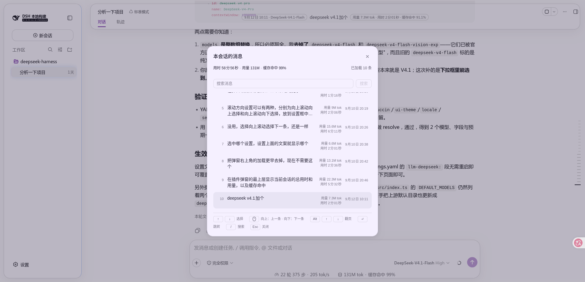
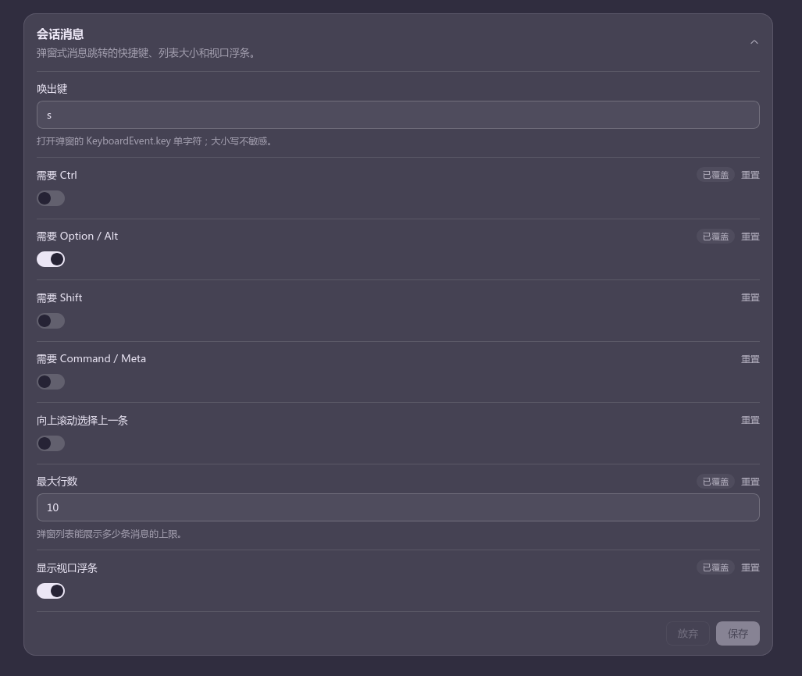
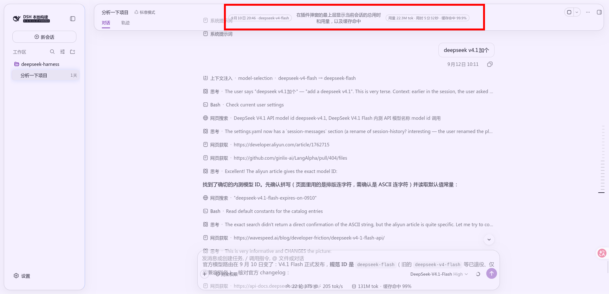

# dsh-session-messages

[English](README.md) | 中文

会话内消息查看器，两块功能：

1. **消息列表**（默认 `Ctrl+S`）：弹出**当前会话已加载的消息**列表，上下方向键选择，
   `Enter` 或点击跳转到该条消息在 transcript 中的位置。列表内可搜索——见「[搜索](#搜索)」。
2. **视口浮条**（可选，默认关闭）：会话标题栏**正中间**的一条，实时显示你**正在读的那条
   消息**及其时钟、用量、用时。见「[视口浮条](#视口浮条)」。

这是一个**独立安装到 profile 的插件**，不修改 `deepseek-harness` 的任何源码（`packages/` 未改动）。



## 语言

插件自己的文案提供七种语言，全部在 `src/client/locales.ts`：

| 语言 | 注册方式 | 说明 |
|---|---|---|
| `en` | 内置，与 `zh` 一同注册 | 事实来源；其余每本字典逐键对应它 |
| `zh` | 内置，与 `en` 一同注册 | |
| `ja`、`ko`、`es`、`fr`、`de` | 语言包语言 | 本插件只提供**字典**；让它们可被选中的**语言定义**属于语言包（本 profile 里是 `dsh-catppuccin`） |

这个分工有两处是刻意的：

- **本插件从不调用 `addLanguage`。** 定义归语言包所有，在这里调用会与语言包已有的定义冲突而抛错；
  而且只凭一个命名空间就去声明一种语言，会让选择器里出现一个几乎全是英文的条目。
- **每本字典都标注为 `Record<MessagesKey, string>`。** 往 `MessagesKey` 加一个键，七份翻译
  补齐之前**编译不过**，所以不会出现「某个键只是忘了翻译、于是静默退回英文」的情况。
  这个保证比 `en` 回退链本身更重要。

每个面向用户的字符串都走 locale 座位读取，包括它在 slot 台账里的条目名——那是个 thunk，
切语言无需重新注册。时钟仍是宿主的：它只有时刻，没有标签。

若 profile 里没有语言包，这五种语言就不出现在选择器里、对应的字典闲置，其余行为不变。

**宿主气泡里的标签不能信。** 宿主自己的胶囊只有 `zh` / `en` 两套，在任何语言包语言下它都
回退成英文，于是 `Usage 1.06k tok` 会出现在日语界面里。所以每行右侧那两个数字是**拆开取**的：
数字照抄宿主气泡（单轮 token 与墙钟在本插件的位置上算不出来），标签换成本插件自己的
`turnUsage` / `turnDuration`。

### 各语言保持同一套排版

文案变长不应该让版面重排。三条机制，各针对一种可能的破法：

- **弹窗的行天然语言无关**：正文是 `flex: 1` 配 `min-width: 0`，所有宽度差异都被它吸收；
  而用量/用时那一列和时间戳是 `flex: none`，钉在右端——时间戳始终落在正文第一行，任何语言都一样。
  弹窗标题和页眉的会话总计改为**省略号截断**，不会把关闭按钮和已加载条数挤出这一行。
- **浮条的两个胶囊不能重排**——它们是 `Tag`，`nowrap`，所以它们的长度直接决定正文能拿多少宽度。
  七种语言的正文列因此宽窄不同，这一点被接受了：压短标签的代价是歧义。
  早先的版本把缓存命中率削成光秃秃的 `Caché` / `Cache`（只剩对象、丢了「率」），
  现在七种语言各用自己的标准简称（`缓存命中` / `Cache hit` / `キャッシュ率` / `캐시 적중률` /
  `Aciertos de caché` / `Taux de cache` / `Cache-Treffer`）——**术语优先于那几十像素**。
- **浮条的会话级字段改为响应式读取**，走座位的标准 `useProjection` 而不是注入面。
  轮询式读取可能在会话绑定就绪前返回空，导致模型与缓存命中**短暂消失**——
  那会让某一种语言看起来和另一种不一样，而原因和语言毫无关系。

## 目录

```text
session-messages-plugin/
  package.json        dsh.bundle + dsh.client 声明、exports 映射
  cordis.patch.yml    层补丁（把自己登记为 Loader 条目并给配置）
  build.mjs           构建脚本（tsdown 编程接口）
  tsconfig.json       仅用于 IDE 类型解析，指向 checkout 源码（只读）
  src/
    index.ts                  Node 半：Config Schema + 向页面注入配置
    shared.ts                 两半共享的配置形状与解析
    client/
      index.ts                浏览器半：注册到 shell.overlay 与配置表单两个槽位
      transcript.ts           transcript DOM 契约层（两个消费者共用的采集原语）
      search.ts               搜索：折叠匹配、命中区间、片段提取（纯函数，可单测）
      model-names.ts          模型显示名：宿主目录 → id 的查找表（外部 store，供浮条读取）
      turn-facts.ts           每轮事实：从事件窗口折叠「轮次 → 模型 + 缓存命中率」（用量复用宿主 deriveTurnTokenUsage）
      overlay.tsx             列表浮层组件、消息采集与跳转
      hud.tsx                 视口浮条（注册进会话标题栏的动作座位）
      use-messages-config.ts  解析当前配置（配置表单 → 退化到页面全局）
      session-totals.ts       页眉会话总计：读投影 + 紧凑格式化
      settings-card.tsx       插件页上的配置表单
      settings-form-holder.ts  卡片绑定的配置表单 → 浮层的单向桥
      locales.ts              七本字典（en、zh + 五种语言包语言）
  lib/                构建产物（index.js / client.js）
  docs/               两个 README 引用的截图（en / zh 成对）
```

## 安装

**从 npm 安装**（发布后，装的是预构建产物，不需要任何构建授权）：

```sh
dsh plugin --profile web add dsh-session-messages
```

**从 tarball 安装**（同样不需要授权，适合发布前先用真实产物验证）：

```sh
npm pack                                   # 产出 dsh-session-messages-0.1.0.tgz
dsh plugin --profile web add ./dsh-session-messages-0.1.0.tgz
```

**改本地源码时**（本仓库自身就是插件仓库，可直接 link）：

```sh
npm run build                              # 改了 src 就要重跑
dsh plugin --profile web add .
```

⚠️ **换安装方式前必须先移除**：旧的安装（尤其是 link）会遮蔽新包。

```sh
dsh plugin --profile web remove dsh-session-messages
```

然后**重启** `dsh web`（新增 bundle 层、以及 bundle 内容变化，都需要重启）。

### 开发

```sh
npm ci                                     # 安装依赖
npm run build                              # 产物 lib/index.js + lib/client.js
npm run typecheck                          # tsc --noEmit
```

**依赖版本写死，不要用 `latest`**：`@deepseek-ai/*` 这一族的 `latest` 标签是**过期的**
`0.0.1-rc.1`，与本插件匹配的是 `next` 标签的 `0.1.7-rc.1`——裸装会拿到错版本。
宿主升级时同步更新这里的钉版。

`overrides` 出于同样的理由向下再钉了一层：`tsdown` 依赖 `rolldown ~1.2.0`，但
`rolldown@1.2.10` 没有发布 `@rolldown/binding-linux-arm64-musl` 这个平台包，重新解析会产出一份
`npm ci` 判定为「不同步」的 lock。因此把 `rolldown` 钉在最后一个完整版本 `1.2.9`；等上游补齐
全部平台包后即可删掉这条。

## 使用

| 操作 | 效果 |
| --- | --- |
| `Ctrl+S` | 打开／关闭消息列表 |
| `↑` `↓` | 移动高亮 |
| `Alt`+`↑` `↓`、`PageUp` `PageDown` | 翻页：列表滚一屏，高亮**停在原处**不动（到首尾时贴边）；`maxRows` 小到一页放得下时改为整页切换 |
| `Enter` | 跳转到高亮那条消息 |
| 鼠标移动 / 点击 | 移动高亮 / 跳转 |
| 滚轮 | 上下移动高亮，一格一行；触控板按累计行程换算成整行。方向由 `wheelInverted` 决定 |
| `Esc` | 关闭 |

翻页的 `Alt` 在 macOS 上就是 `⌥ Option`（同一个物理键，提示栏会按平台显示对应字样）；
MacBook 无独立翻页键时可用 `Fn`+`↑` `↓`，macOS 会把它转成 `PageUp`／`PageDown`。

## 配置

编辑 `cordis.patch.yml` 的 `config:` 块，或在 profile 自己的 `cordis.patch.yml`
里按 id `session-messages` 覆盖。快捷键**不是**写死在代码里的：

| 字段 | 默认 | 说明 |
| --- | --- | --- |
| `key` | `s` | `KeyboardEvent.key` 的小写形式 |
| `ctrl` | `true` | 是否要求 Ctrl |
| `alt` | `false` | 是否要求 Alt |
| `shift` | `false` | 是否要求 Shift |
| `meta` | `false` | 是否要求 Meta（macOS Cmd / Win） |
| `wheelInverted` | `false` | 滚轮方向。关闭：向上滚动选上一条；开启：向上滚动选下一条 |
| `maxRows` | `50` | 列表同时渲染的最大条数；窗口跟随高亮整页移动，可当「每页 N 条」用 |
| `showHud` | `false` | 是否在会话标题栏里显示视口浮条（见下节）。默认关闭 |

macOS 想用 `Cmd+S`：`ctrl: false`、`meta: true`。

## 在插件自己的页面里改（免改文件）



上面这些字段也能在界面上改，不必动 `cordis.patch.yml`：

**插件**（侧边栏那一项）→ `dsh-session-messages` → 行列表上方的配置表单，默认展开。

表单列出唤出键、四个修饰键、滚轮方向、最大行数与浮条开关，逐项可调；每个字段都有「重置」，
被用户层覆盖的字段会标出，头部可折叠并在有未保存改动时显示标记，底部「保存」提交草稿、
「放弃」丢弃草稿。改完无需重启。

设置值存放在设置命名空间 `session-messages`（即 `cordis.patch.yml` 里的 profile entry id）里，
由 Node 半把所有 `Config` 字段标记为 `.volatile()` 来声明——只有 volatile 字段才可实时编辑，
浏览器半再通过 `ctx.configForms` 读同一份文档。表单本身注册在插件页的 `plugins.bundle.config`
座位上，key 是**包名**——这个 key 决定表单挂到哪个 bundle 的页面，所以两者要一起改。

## 视口浮条



开关是 `showHud`（配置表单里的「显示视口浮条」，或 `cordis.patch.yml`）。开启后在
**会话标题栏的正中间**出现一块，随滚动实时更新：

```text
21:36 · deepseek-chat  数据来源：读投影，不抓 DOM：关键是从客户端公开的
                       projections.faceOf 读，而不是去抓渲染出来的 DOM。
                                        用量 1.2k · 用时 12.3s · 缓存命中 99%
```

（左右两端其实是两个**描边小胶囊**：「何时 · 用哪个」和「花了多少」。正文最多 3 行，
与它们并排在同一行——纯文本写不出这个效果，见下面「两旁的内容用 `Tag`」。）

是**标题栏的正中**，不是视口的正中——它注册进 `conversation.session.header.actions`
（宿主为「标题旁的会话动作」声明的座位，`ui-agent-preset` 的模式标签和 `ui-jobs`
的任务列表用的是同一个），但**不按座位排队**，而是把自己移出文档流，居中在标题行上。

### 怎么做到居中的

两个轴都对着 **header 盒子本身**：水平是它的中线，垂直也是它的中线。

**水平** —— 纯 CSS。`position: absolute` 的包含块是 ui-conversation 的 `.root`，它声明了
`position: relative`，注释写明的用途就是 `positioning context for slot-owned absolute
chrome`。header 横跨整列，所以 `.root` 的 50% 就是 header 自己的中线；左侧栏收起或展开时
都不会偏，而视口的 50% 会。

**垂直** —— 测量 `<header>` 自己，取它的中线。浮条脱离文档流，CSS 里没有任何东西知道
header 的盒子在哪，所以必须量。

锚在 **header** 而不是标题行，因为「浮层居中」指的就是这条 header 盒子：它除了标题行，
下面还挂着「对话／轨迹」页签，比第一行高得多。锚在标题行会让浮条明显偏高——那是第二版。

两条试错记录，避免重犯：

| 试过 | 结果 |
|---|---|
| `top: auto` 的**静态位置** | 规范说 flex 容器的绝对定位子元素「如同它是唯一 flex item」那样排布，理应吃到 `align-items: center`。**实测落在包含块顶边**，浮条被窗口裁掉。 |
| 锚座位自己的盒子 | 哪个盒子会塌缩取决于组合——`headerActions` 在浮条是它唯一子元素时高度为 0，corner 空时 `display: none`——于是要一串候选兜底。而 header 是一个永远在的元素，白绕。 |

移出文档流也是能居中的前提：座位的 `headerActions` 是 `flex: none`，而这一行的自由空间握在
`titleCluster`（`flex: 1`）手里，**留在座位里的普通元素永远到不了中间**。

`top` 写的是**元素上沿**、transform 只做水平，所以万一测量没跑，浮条退回静态位置仍然可见，
不会被拉出屏幕——第一版用 `translate(-50%, -50%)`，同样情况下整个消失。

`top` 是直接写节点、不走 React state 的：它是布局的函数，走 state 就等于在测量它的那个
帧循环里再塞一次 setState。

### 外观是抄的，不是设计的

抄的是同一个座位里那个模式标签的配方（`AgentPresetLabel.module.css`）：

| 属性 | 值 | 与模式标签 |
|---|---|---|
| `border-radius` | `6px` | 一样的圆角矩形，**不是药丸** |
| `background` | `var(--dsw-alias-fill-tsp-secondary)` | 同一个半透明 fill，不是 `bg-layer-*` |
| `color` | `var(--dsw-alias-label-secondary)` | 同一层文字色 |
| `min-height` | `22px` | 下限同高；**不再固定高度**，见下 |

第一版用的是「999 圆角 + 硬边框 + `bg-layer-3` + `label-primary`」——header 自己的任何
chrome 都不是这么做的，于是看起来像贴上去的一张卡片。**要融进一块 UI，先抄它已有的配方，
别自己发明一套。**

### 正文按可读的字号排版，不是按 chip

一处**刻意偏离**模式标签：消息正文用 14px / 20px（与 transcript 正文同号）并允许换行、
最多 3 行，而不是 chip 的 12px 单行。因为这是拿来**读**的，不是拿来扫的标签。

- 容器因此是 `min-height` 而非固定 `height`，随行数长高。
- 预览字符上限 `MAX_HUD_CHARS = 500`，视觉上限由 3 行的 `-webkit-line-clamp` 兜底——
  上限给得宽是因为窄字符（拉丁文）在同样三行里能装下更多，切早了反而少显示。
  `overlay.tsx` 的行预览用的是同一套 `-webkit-box` 三段式。

### 两旁的内容用 `Tag`，不是「看起来像 Tag」

时钟和用量/用时是宿主的 **`Tag` 原语**（`tone="outline"`），不是自己用 span 摆出来的。
`Tag` 自带几何（999 圆角、`1px 8px`、11px/17px、`nowrap`）与配色
（`0.5px solid var(--dsw-alias-border-l4)` + `label-tertiary`），所以这里一个字都不用重述。

为什么必须这么改：之前三部分都是纯文字 + 同一个底色，**读者没法一眼看出消息从哪儿开始**。
描边胶囊是"元信息"的视觉语言，正文不是——一层对比就分开了。

顺带两个不用操心的点：

- `Tag` 的盒子含发丝边框正好 20px，与正文 14px/20px 的首行盒同高：**单行消息**时两侧胶囊
  无需任何微调就与正文齐平。
- 消息换行时靠容器的 `alignItems: center` 保持居中——两个胶囊对**整个消息块**取中，
  而不是挂在它的第一行上（那样在双行预览旁边看起来像胶囊往上飘了）。
- 用 `Tag` 组件而不是抄它的 CSS：它从模块表里 require（external），拿到的就是宿主**已经
  加载的那份**，样式天然一致、也不会随宿主改版漂移。

**三个部分一律居中**，靠两件事同时成立：

- 正文 `flex: 0 1 auto`——**可以缩，但不许长**。让它长（`1 1 auto`）会让浮条永远等于
  `maxWidth`，把时钟顶到左端、数字顶到右端：三个部分钉在一个宽盒子的两端，怎么看都不是
  居中。不给它长，浮条就贴着内容，三者自然聚成一组。
- 容器 `textAlign: center`，让换行后的正文各行居中，而不是左对齐。

### 显示什么：五个字段，两种粒度

胶囊的分工是「何时、用哪个」在左，「花了多少」在右：

| 字段 | 粒度 | 来源 |
|---|---|---|
| 时钟 | 该条消息 | 行内 `IconActions` 的标签 |
| 消息正文 | 该条消息 | 行内文本（剥离行尾时间戳叶子） |
| 用量 / 用时 | **该轮** | 该轮轮尾的那两个胶囊 |
| 模型 | **该轮** | 该轮 `assistant/message` 事件里的 `message.source`，经绑定的事件窗口折叠（`turn-models.ts`）。**显示名**再经 `remote.session.modelCatalog()` 解析成与输入框选择器一致的写法；轮次取不到时显示「未知模型」 |
| 缓存命中 | **该轮** | 该轮的用量（宿主 `deriveTurnTokenUsage` 在事件窗口上折叠）→ `cacheRead / 计费输入`，精度对齐宿主的 per-turn 对话框（1 位小数） |

模型能按轮取到，靠的是会话自己的**事件窗口**（`binding.eventSource`）：每轮的
`assistant/message` 事件里带 `message.source.{provider,model}`——宿主算每轮 routes 用的就是它——
所以浮条读到哪一轮就显示哪一轮，翻回切换模型之前的消息不会再显示当前选中的模型。
窗口没覆盖到的轮次（更早的历史）显示**未知模型**——**不用会话级 `modelSelection` 顶替**：
那是另一个时刻的事实，填上去等于用同样肯定的语气说一件错事。

**缓存命中率同样按轮取。** 用量交给宿主的 `deriveTurnTokenUsage`
（`@deepseek-ai/dsh-token-meter/client`，ui-chat 建轮尾用的就是它）在事件窗口上折叠，
再走宿主那份格式化（1 位小数、接近满分时加精度）。**不自己重写聚合规则**：哪些事件算数、
流式样本与最终消息谁覆盖谁、不完整的轮次返回空——这些规则很细，自己再实现一遍，
第一次偏差会一直隐形，直到有人比较两个界面。正在进行的轮次拿不到（宿主对该情形 fail closed），
此时该片段不显示。

轮次级数据还有另一条取法——`conversation.chat.node` 席位注入的 `useTurnData`，占位者还能从
`node.location.turn.start/end` 算出该轮墙钟——但它只回答「你这个节点渲染的那一轮」，
而本插件要**任意一轮**（浮条跟视口）和**全部轮次**（列表）；那个席位也占不得：
slot 的 key 是 ui-chat 自己的 `ChatNodeKind`，占一个 key 会**替换**宿主的渲染器。
本插件因此走事件窗口。

口径与宿主一致：分母是**计费输入三桶之和**（与宿主 `StatsPills` 的 `billedInputTokens` 逐字相同），
百分比**照搬**宿主 `token-format.ts` 的 `formatCacheHitPercent`——同一个投影、同一份算法，
所以浮条、页眉与底部状态栏印出的数字逐字相同。宿主那条规则值得说明：部分命中接近满分时
**不夹紧成 99.9，而是加小数位**（`99.6` / `99.95` 这种形状），既真实、又明显不是满分。

模型显示的是**输入框选择器上那个展示名**（如 `DeepSeek-V4.1-Flash`），经
`remote.session.modelCatalog()` 解析；目录里没有它时（例如模型已退役）退回原始 id，
轮次取不到时显示「未知模型」。展示名**不从** `ctx.modelDirectories` 取：
那是会惰性创建 per-session 状态、并对不在活动列表里的会话抛错的**选择面**，
不该为一个只读标签拉进来。

宽度上限因此是 `min(760px, 58vw)`，而不是更窄的值——**胶囊不可压缩**，
上限太窄会先挤掉正文，而那正是这条浮条存在的意义。

`pointer-events: none` 是因为它可能压到长标题的尾部，不能吃掉点击。

顺带免费得到的：会话空白时 header 整体 `display: none`，浮条作为后代一起消失，
插件不需要自己判断会话状态。

四个字段全部来自该行与所在轮的既有契约，插件不自己算任何数字：文本取自行内文本
（剥离行尾时间戳叶子），时钟是 `IconActions` 的标签，用量与用时是该轮轮尾的那两个胶囊——
与列表行里显示的是同一份数据源。

### 「正在读的那条」怎么判定

取**最后一条到达视口顶部「锚带」的行**，而不是「第一条还在屏幕里的行」。

理由是实测的：一条用户消息只有一行高，它的回答却可能有几屏。若按「还在屏幕里」判定，
读长回答时用户消息早已滚出视口，浮条就会**大段空白**——那看起来像坏了，而不是像没内容。
按「已到达锚带」判定则像粘性小标题：一直显示你正在读的这条，直到下一条到达锚带。
全部行都还在锚带之下时（读者在第一条之上），回退到第一条。

**锚带（`FOLD_BAND_PX`）不是 0，这点很关键。** 它是「视口上沿 + `LAND_OFFSET_PX` + 2px」：

- `landOnRow` 把跳转目标**落在视口上沿下方 `LAND_OFFSET_PX`（24px）处**——那点呼吸空间正是
  它存在的意义。若判定写成严格的「已跨过上沿」（`top < viewTop`），目标行**还没跨过**，
  浮条就会显示**上一条**：每次跳转都慢一条。
- `+2px` 是亚像素余量：落点量出来是 24.0000…，用裸 `<` 会被卡掉。
- 锚带变宽还让滚动时浮条**稍微早一点**翻到下一条——这个方向本身就是想偏的。

`LAND_OFFSET_PX` 因此从 `overlay.tsx` 提到了 `transcript.ts`（两者共用的契约层）：
跳转的落点算术和浮条的判定带宽本来就是同一件事，各写一份必然发散。

**这条判定是浮条和弹窗共用的**：两个界面都要回答「读者在哪一条消息上」，此前各写一份——
浮条用这条 sticky 带宽规则，弹窗用「至少可见 30px」✗——两者只在一种情况下分歧，而那正是最常见的：
**一条长消息滚到只剩一小截露在顶部**时，浮条继续指着它（读者确实还在里面 ✓），
弹窗却因为不足 30px 而跳到下一条 ✗，于是同一滚动位置两个界面指向不同消息 ✓。

现在只有 `transcript.ts` 的 **`readingRow(scroller)`** 一处判定（内部调用纯函数 `pickRowUnderFold` ✓），
浮条的 `hitOfViewport` 与弹窗的 `collectMessages` 都读它 ✓ —— **同一滚动位置必然得到同一条消息** ✓。
弹窗保留「贴底时取最新一条」这一例外 ✓（新建会话时最后一条还没到达锚带 ✓）。

要改规则，改 `transcript.ts` 的 `pickRowUnderFold` 一处即可 ✓（`fold-rule-check` 那组用例锁定它 ✓）。

### 为什么它比列表便宜

浮条跑在滚动帧上，所以走的是另一条采集路径（`transcript.ts` 是两者共用的契约层）：

- **不克隆整屏**。列表每次采集 `cloneNode` 每一行；浮条只解析视口那**一行**，并按行 id
  缓存结果——同一轮内滚动，克隆次数为 0。
- **不建全量统计表**。列表扫所有轮尾建 `Map`；浮条按 `data-chat-turn` 直接定位那一个轮尾。
- 扫描**提前退出**：行按文档序排列，遇到第一个还在锚带之下的行即停。
- 四个字段都没变时交回原对象，让 React 跳过重渲染。

### 刷新时机

| 触发 | 为什么 |
|---|---|
| `scroll`（document 的 **capture** 阶段） | 滚动事件不冒泡，但 capture 能收到所有后代的；这样不必先找到滚动容器，也顺带解决了「容器可能还不存在」 |
| `resize` | 换行会改变哪一行在视口里 |
| 每 1 秒 | 轮次结束时胶囊的最终值是一次 **DOM 变更而非滚动**；只靠滚动监听会让浮条永远停在流式进行中的数字上 |

浮条是 `aria-hidden` 的——它复述屏幕上已有的内容，不该被读屏重复播报。
它也不再需要任何层级处理：它是 header 的后代，本来就在 transcript 之上、弹窗之下。

## 消息列表从哪来

列表从**已渲染的 DOM** 采集，而不是从某个 API：唯一给出轮次数据的
`conversation.chat.node` 席位只覆盖它自己渲染的那一轮，而列表要全部轮次——见上文的作用域约束。
这不是 hack —— 这些属性都是 `ChatView` 自己用来定位的契约：

- `[data-conversation-scroll]` —— 滚动容器（`ChatView` 的 `scrollerOf` 就是查它）
- `[data-chat-flow-kind="user" | "steering"]` —— 一条人类消息行
- `[data-chat-anchor-key]` —— 行标识（`ChatView` 用同一个属性做滚动位置恢复）
- `[data-chat-turn]` —— 行所属的轮次
- `[data-turn-tail]` —— 该轮的轮尾，里面的用量/用时胶囊就在这

时间戳叶子靠**内容**识别，而不是选择器（宿主的类名是哈希的）。而识别用的正则**照着宿主自己的
`clock.md` / `clock.ymd` 模板写**，不去猜某种语言怎么写日期：

| 语言 | `clock.md` | `clock.ymd` |
|---|---|---|
| `zh` | `{m}月{d}日` | `{y}年{m}月{d}日` |
| `en` | `{m}/{d}` | `{y}-{m}-{d}` |

其余语言全部回退到 `en`，所以宿主能打印的只有这五种形态。**这就是为什么正则是五条显式分支、
而不是「中文一种 + 英文一种」**：早先的版本按注释里假想的 `Mon D` 写，匹配不上宿主真实的
`9/10 20:16`，于是时间戳没被剥离、被拼到了正文末尾——**所有非中文语言都会出现，而且两个界面
同时中招**（它们共用同一次拆分）。

两个界面共用这套原语，都在 `transcript.ts` 里。

每行右侧的**用量**与**用时**也不是自己算的，而是取该行所属轮次轮尾上那两个胶囊
（`TurnUsagePanel` / `TurnTimePanel`）里的**数值**：宿主已经把单轮 token 和墙钟算好并格式化。
**但标签不用宿主的**——从第一个数字处切开只留数值，前面接本插件自己的
`turnUsage` / `turnDuration`，因为宿主那两套标签只有 `zh` / `en`，语言包语言下会回退成英文。
胶囊类名是哈希的，所以按**契约位置**定位：轮尾里最后两个 `aria-haspopup="dialog"`
按钮依次是用量和用时，再用图标几何区分（用量是数据库图标，含 `<ellipse>`；用时是时钟图标，含 `<circle>`）。

跳转用的也是 `ChatView` 自己的算式：
`scrollTop += row.top - scrollport.top - 24`。

代价：**只能列出已加载窗口内的消息**。窗口外的由插件自己翻进来，无需手动操作：
打开时填充到 `maxRows` 条；高亮进入最旧 8 条以内时再预取一页（走 `ISession.loadOlder()`）。
预取不会为同一页重复触发——高亮按 id 记录，翻入 N 条后它的下标自动增大 N，脱离触发区。

## 搜索

列表内按 `/` 聚焦搜索框（也可以直接点），输入后按 `Enter` 或点「搜索」提交。

**边打边筛是有意不做的。** 语料是采集来的 DOM，每次采集都要克隆行；把它放到每次按键上，
代价真实，产出的却是一份在读者手底下不断变动的列表。

### 匹配

```text
NFC 归一化 → 小写化 → 子串包含
```

- **NFC 不是可选项。** 输入法打出的 `が` 可能是单码位，也可能是 `か` + 浊点；不折叠的话，
  读者**看得见却搜不到**。折叠同时也是区间能落在屏幕上真正那个串上的原因
  （折叠在采集处就已经做了，见 `transcript.ts`）。
- **纯子串，不当正则。** 读者输入 `(` 或 `[` 是在输入消息里的字符，不是在写正则；
  解析不了的查询是一种他没法靠多打几个字解决的失败。
- **大小写折叠与语言无关**（`toLowerCase` 而非 `toLocaleLowerCase`）：`I` 能不能匹配 `i`，
  不该取决于界面碰巧在说什么语言。
- **时间戳也参与匹配**：`9/10` 这种查法很自然，而标签本来就在行上。

### 命中要看得见

行预览截断到两行，所以命中若在深处，就会出现一条**标着命中却看不出为什么**的行。
因此搜索运行时，预览改显**命中所在的那一段**，两端各加省略号；清空查询即恢复
「消息开头 + 截断」。区间由 `search.ts` 的纯函数返回，且已经重定位到将要渲染的那个串上。

### `Enter` 的三重含义

按状态决定，不按模式：

| 状态 | `Enter` |
|---|---|
| 输入框里有未提交的内容 | **提交搜索** |
| 已在过滤中，且内容已提交 | **跳转到高亮那条** |
| 命中为零 | **把语料往前翻一页，再筛一次** |

第三行就是「继续往前找」的全部交互——不加按钮、不加按键。每次只买一页，`hasMore()` 为假时停下，
所以不会为一个查不到的词把整个历史拉进来。

`Esc` 逐级退出：先清查询，再关弹窗。已提交的查询和正在输入的一样算「有查询」，
所以过滤器不会藏在空输入框背后继续生效。

### 覆盖范围

**搜的是已加载窗口，不是整个会话。** 这不是省事，是边界：宿主没有给客户端插件提供会话内搜索——
`ctx.sessions.search` 是跨会话的，每个会话只回一条最佳片段且不带消息锚点；
粒度合适的 `sessionQuery.searchEvents`（命中带 `seq`）只存在于宿主侧，没有对应的 remote endpoint。

所以页眉把两个数一起报出来：`匹配 3 / 共 50 条`。分子是命中数，分母是**被搜过的**条数——
只报分子会被读成对整个会话的回答。

## 页眉的会话总计

弹窗最上层是整场会话（不是已加载窗口）的三个数字：

```text
用时 2分42秒 · 用量 5.5K · 缓存命中 60%          已加载 30 条
```

它们**不是**从 DOM 抓的，而是读 `ISession.projections` —— 客户端公开的投影读取面
（`faceOf(key).getSnapshot()`），两个键都是宿主按**整条日志**算好的：

| 键 | 取用字段 | 页眉口径 |
| --- | --- | --- |
| `sessionStats` | `llmMs`、`toolMs` | `用时` = 模型请求 + 工具执行的总墙钟时间 |
| `tokenUsage` | `uncachedInputTokens`、`cacheReadTokens`、`cacheWriteTokens`、`outputTokens` | `用量` = 计费输入 + 输出；`缓存命中` = 缓存读取 / 计费输入 |

为什么不抓 DOM：这两个值不存在于任何可见文本里（会话时间只在统计弹窗内，且弹窗默认关闭），
而读数字还省掉了“把 `1.2K` 这类紧凑文本解析回数字”这一步。格式化按宿主同一套口径：
紧凑 token（`12.2K` / `1.2M`）、紧凑时长（`45.2s` / `2m42s`），
且缓存命中用的是宿主那份算法（见上文），**部分命中不四舍五入成 100%**——
接近满分时加小数位，而不是夹紧。

## 配置如何从 Node 半传到浏览器

启动图（boot graph）不携带 config，所以 Node 半监听 `webserver/index-inject`，
推入一行 `{ kind: 'global', name: '__DSH_SESSION_MESSAGES_CONFIG__', value: config }`；
浏览器半读取该 global，缺失时回退到同一份默认值。

## 实现要点

- **浮层落点**：`shell.overlay` 槽位（ui-layout 声明，frame 级、不拦截点击）。
  组件常驻挂载、关闭时返回 `null`，这样快捷键监听一直有效。
- **键盘用捕获阶段**：composer 是 Lexical 编辑器，以 `COMMAND_PRIORITY_CRITICAL`
  注册自己的按键命令；冒泡阶段监听会被它先吃掉。
- **`Ctrl+S` 必须 `preventDefault()`**：浏览器默认是「保存网页」。
- **滚轮监听必须原生且非 passive**：React 在根节点以 passive 方式注册 `onWheel`，
  在合成事件里 `preventDefault()` 拦不住列表自身滚动，结果高亮移动和列表滚动会叠加；
  所以直接对列表元素 `addEventListener('wheel', …, { passive: false })`。
- **客户端包必须是 CJS**：产物被包进 `window.__ModuleLoader__.load({ factory: (require) => {...} })`，
  函数体内不能出现 ESM `import`。tsdown CLI 因缺 `unrun` 起不来，改用 `build()` 编程接口并传 `config: false`。
- **只有模块表认得的说明符保持 external，其余一律打包。** 模块表只解答三类东西：平台 seed
  （`react` / `react-dom`）、已物化模块、以及已注册的包工厂（组合里各客户端包的 bundle）。
  表里没有的包，**无论怎么声明都在运行时不可达**——`require` 会抛「missed the module table」，
  也就是报错里说的"构建期外部化漂移"。所以是**白名单**：`react` / `react-dom` /
  `@deepseek-ai/dsh-client-ui-primitives` 留给表（实例身份必须与外壳同一份），
  其余（含 `@deepseek-ai/dsh-token-meter/client`）**打包进来**——打包永远能用，
  外部化错了就在启动时炸。宿主 ui-chat 能 import 那个折叠函数，是因为它被
  **打进了同一个 bundle**，而不是表提供了它。
  白名单**按包名匹配而不是精确串**：JSX 转换会 import `react/jsx-runtime`，
  把它打包进来会顺手把 React 的**开发分支**（读 `process.env.NODE_ENV`）带进浏览器 ✗。
- **构建期有两道自检**（`assertBrowserPurity`）：产物不得出现 `process.` / `Buffer` /
  `__dirname`，且产物里每个 `require(...)` 都必须在上面那份白名单内。两条都是真实踩过的坑
  （「missed the module table」与「process is not defined」），而它们在构建时**完全可见**——
  与其等到页面加载失败，不如让构建直接失败。
- **Node 半相反：裸导入全部保持 external**，交给 Node 解析——`schemastery` 一旦被打包，
  宿主的 Schema 就会多出第二份副本，而 Schema 身份是按引用比较的。

## 已知限制

- 只列已加载窗口内的消息；更早的由打开时的填充与接近最旧一条时的预取自动翻入，没有手动按钮。
  **搜索同样只覆盖这份窗口**：命中为零时按 `Enter` 是唯一的「继续往前找」，每次一页。
  浮条读的**每轮模型**也在其中：窗口之外的轮次显示「未知模型」。
- 搜索不跨打开保留：每次打开清空查询并恢复完整列表（弹窗的首要职责是定位，不是筛选）。
- 模型**显示名**取自宿主目录（`remote.session.modelCatalog()`）；组合里没有 remote 图层时，
  浮条退回显示模型 id（如 `deepseek-flash`），其余行为不变。
- 视口浮条只跟踪**人类消息**（`user` / `steering` 行）——插件的整个数据模型就是这类行，
  助手回答本身不是浮条的对象。读长回答时它显示的是那条回答所属的提问。
- 消息预览取自行内文本（剥离行尾时间戳叶子），超长截断到 240 字符后再交给 CSS 省略号。
- 用量/用时取自该轮轮尾的胶囊：轮次还在进行、或该轮没有计时/用量时，对应位置留空。
- 页眉的会话总计在打开时、以及每翻入一页时重新读取（快照语义，与列表一致），不是实时订阅；轮次进行中时不会跳动。
- 只有 `sessionStats` 与 `tokenUsage` 两个投影**都**缺失时，页眉才只显示已加载条数；
  缺其中一个仍会显示另一个能算出的部分，不会显示 0。
- 会话切换后列表在下一次打开时重建（打开瞬间采集）。
- 浮层用了行内样式而非 CSS Modules：独立插件拿不到仓库的 tsdown CSS 预设。
- `node_modules/@types/react` 是指向仓库 pnpm store 的软链，只为 IDE 类型服务；
  `@types/react` 升级后需重链。
- IDE 会对 `cordis.patch.yml` 误报 JSONPatch schema 错误（仓库内同名文件不报），属误报。
